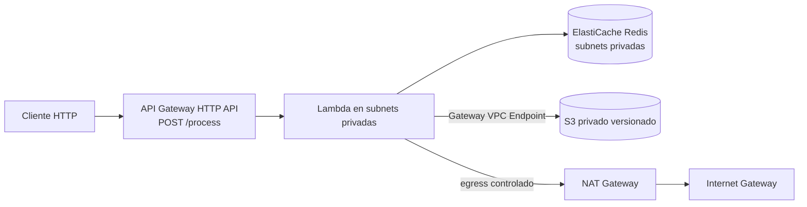

# SRE Process Service - AWS Serverless Terraform

Infraestructura serverless para recibir solicitudes HTTP, procesarlas en Lambda, persistir resultados en S3 y usar Redis como caché.

## Arquitectura



## Decisiones de diseño

- **HTTP API**: se usa por menor costo y menor latencia frente a REST API para una ruta simple con integración proxy Lambda.
- **Lambda en VPC privada**: cumple el aislamiento solicitado y permite comunicación privada con Redis.
- **Redis `cache.t3.micro`**: opción económica válida para una prueba técnica.
- **S3 Gateway VPC Endpoint**: el acceso privado a S3 se enruta desde las tablas privadas sin salir a internet.
- **Security Groups segmentados**: Redis solo acepta TCP/6379 desde el SG de Lambda; Lambda solo tiene egress a Redis/6379 y HTTPS.

## Pre-requisitos

- Terraform >= 1.6
- AWS CLI configurado
- Permisos para crear VPC, IAM, Lambda, API Gateway, ElastiCache, S3 y CloudWatch Logs

## Despliegue

```bash
cp terraform.tfvars.example terraform.tfvars
terraform init
terraform plan
terraform apply
```

## Verificación end-to-end

Obtén el endpoint:

```bash
API_URL=$(terraform output -raw api_process_url)
BUCKET=$(terraform output -raw results_bucket_name)
```

Primera llamada, debe retornar `X-Cache: MISS`:

```bash
curl -i -X POST "$API_URL" \
  -H 'Content-Type: application/json' \
  -d '{"customerId":"123","amount":100}'
```

Segunda llamada idéntica, antes de 60 segundos, debe retornar `X-Cache: HIT`:

```bash
curl -i -X POST "$API_URL" \
  -H 'Content-Type: application/json' \
  -d '{"customerId":"123","amount":100}'
```

Validar objeto en S3:

```bash
aws s3 ls "s3://$BUCKET/results/$(date +%F)/" --recursive
```

Guarda capturas o salidas de estos comandos en `evidence/`.

## Limpieza

```bash
terraform destroy
```
